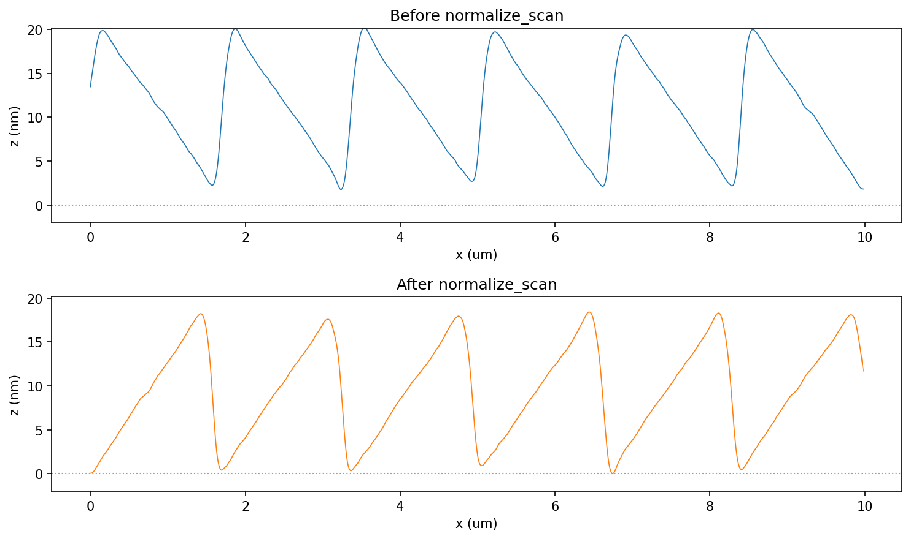
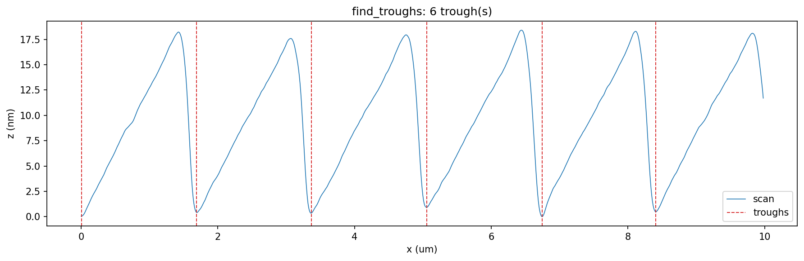
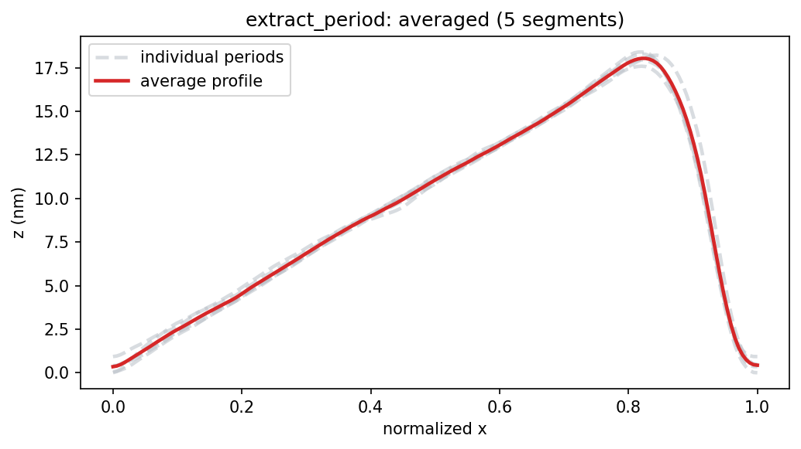
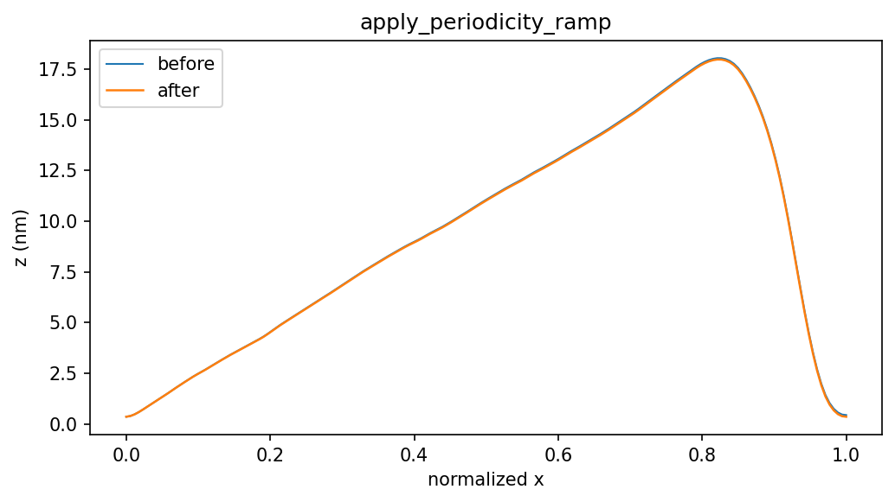

# AFM Preprocessing to ProfileGrating

This tutorial shows the AFM preprocessing pipeline with a sample AFM line scan
and builds an `AFMGrating` that can be simulated with the normal `grax`
workflow.

## Pipeline overview

```python
import numpy as np
import grax as rp

period_lpermm = 600
period_nm = 1e6 / period_lpermm
afm_file = "examples/grating/data/afm_profile_example.txt"
afm_data = np.loadtxt(afm_file)

afm = rp.AFMPreprocessing(
    afm_data,
    units="m",
    # save_plots=True by default (writes to ./results/afm_preprocessing)
    show_plots=False,
)
afm.normalize_scan(reverse=True, zero_baseline=True)
afm.find_troughs(period_nm=period_nm, min_separation_fraction=0.4)
afm.extract_period(average=True)
afm.apply_periodicity_ramp()
afm.rescale_period(period_nm=period_nm)

grating = rp.AFMGrating.from_preprocessing(
    afm,
    # period_lpermm can be inferred from the processed profile span
    # period_lpermm=period_lpermm,
    substrate_material="Si",
    layer_material="Au",
    layer_thickness_nm=30.0,
)
```

## Step-by-step preprocessing

The preprocessing pipeline saves four diagnostic figures by default in
`results/afm_preprocessing`. Each figure corresponds to one explicit pipeline
step.

### Step 1: `normalize_scan(reverse=True, zero_baseline=True)`

This step flips the scan direction (if needed) and shifts the baseline so the
minimum groove height is at `z = 0`. Using a common baseline makes trough
detection and period extraction more robust and easier to interpret.



### Step 2: `find_troughs(period_nm=..., min_separation_fraction=0.4)`

This identifies groove-bottom candidates using a minimum separation based on
the expected period. The red dashed markers show the trough indices that define
available trough-to-trough segments.



### Step 3: `extract_period(average=True)`

This interpolates every detected trough-to-trough segment onto a common
normalized x-grid and averages them. Dashed curves are individual periods
(one color per segment); the solid red curve is the averaged unit-cell profile
used downstream.



### Step 4: `apply_periodicity_ramp()`

This optional correction enforces periodic endpoint continuity by removing a
linear offset between `h(0)` and `h(T)`. Use it when strict periodic boundary
consistency is needed for RCWA.



## Notes

- Use `average=True` in `extract_period()` when scan noise creates visible
  period-to-period variation.
- Use `apply_periodicity_ramp()` when the extracted period endpoints differ and
  you need strict periodic continuity for RCWA.
- By default, preprocessing plots are saved to
  `./results/afm_preprocessing`. Set `save_plots=False` to disable file output.
- `AFMGrating.from_preprocessing(...)` accepts the full preprocessing object so
  the exact validated profile state is used directly. `period_lpermm` may be
  passed explicitly or inferred from the extracted profile span.
- The `03_extract_period_averaged` plot shows all individual normalized periods
  as dashed colored traces plus the solid averaged period profile.
- The full runnable script lives at
  `examples/grating/afm_preprocessing_profile.py`.
